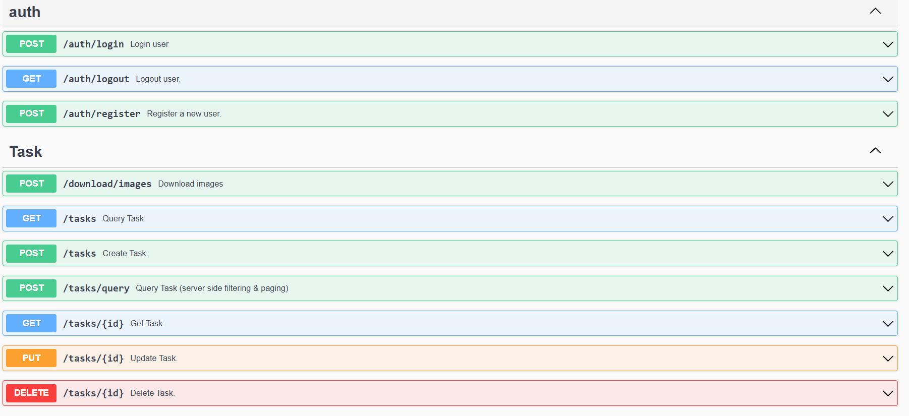

# GoAPIBackEnd

A professional RESTful API backend implemented in Go using the Gin framework. The API provides task management functionality, user authentication, and image downloading capabilities.



## Table of Contents

- [Features](#features)
- [Technologies](#technologies)
- [Installation](#installation)
- [Usage](#usage)
- [API Endpoints](#api-endpoints)
- [Authentication](#authentication)
- [Project Structure](#project-structure)
- [Development](#development)

## Features

- **Security**: Session-based authentication with CSRF protection
- **Task Management**: Full CRUD API for tasks
- **Advanced Search**: Filtering and pagination capabilities
- **Image Downloading**: Concurrent download of multiple URLs
- **API Documentation**: Integrated Swagger UI
- **High Performance**: Goroutines for concurrent operations

## Technologies

- **Go 1.24.7** - Programming language
- **Gin Framework** - Web framework
- **UUID** - Unique identifiers
- **bcrypt** - Password hashing
- **Swagger** - API documentation

## Installation

1. **Clone the repository**:
```bash
git clone <repository-url>
cd GoAPIBackEnd