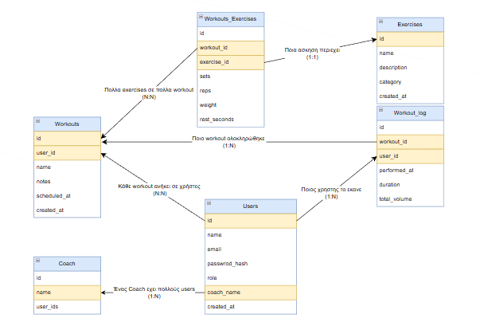

# GoAPIBackEnd

A RESTful API service built with Go and Gin framework, featuring JWT authentication, GraphQL support, and Swagger documentation.



## Project Structure

```
.
├── cmd/
│   └── api/
│       └── main.go              # Application entry point
├── congig/
│   └── config.go                # Load envaronment variables
├── database/
│   ├── schema.sql               # Schema from database
│   └── schema-changes.sql       # Change the database
├── docs/                        # Swagger documentation
│   ├── docs.go                
│   ├── swagger.json   
│   └── swagger.yaml         
├── internal/
│   ├── api/                     # HTTP handlers
│   │   ├──  api.go
│   │   ├──  client.go
│   │   ├──  handler_Coach.go
│   │   ├──  handler_Exercise.go
│   │   ├──  handler_Users.go
│   │   ├──  handler_WokroutLogs.go  
│   │   ├──  handler_WokroutLogs.go 
│   │   └──  handler_Wokrouts.go    
│   ├── apperrors/
│   │   ├──  apperror.go         # Error handlering
│   ├── auth/
│   │   └──  middleware.go       # JWT and role-based middleware
│   ├── database/
│   │   ├── database.go          # Connection with database
│   │   └── crud.go              # Database queries
│   ├── graphql/
│   │   └── schema.go            # GraphQL schema definitions
│   ├── http/
│   │   ├── httpserver.go        # Route definitions
│   │   └── httpserver_test.go   # Route tests
│   ├── type/                    # Data models
│   │   ├── misc/    
│   │   │    └── params.go         
│   │   └── modeles/
│   │   │    ├── exercises.go
│   │   │    ├── users.go
│   │   │    └── workouts.go             
│   └── server.go                # Server initialization
├── .env                         # Include all variables
├── air.toml                     # Air live reload configuration
├── Makefile                     # Build and run commands
├── go.mod                       # Go module file
└── README.md                    # This file
```

## Features

- RESTful API with Gin framework
- Swagger/OpenAPI documentation
- JWT-based authentication
- Connect with database
- Role-based access control (admin/user)
- GraphQL endpoint with GraphiQL interface
- Test Routes API
- Task management CRUD operations
- Server-side filtering and pagination
- Image download functionality

## Prerequisites

- Go 1.24 or higher
- Make (optional, for using Makefile commands)

## Installation

1. Clone the repository:
```bash
git clone <repository-url>
cd GoAPIBackEnd
```

2. Install dependencies:
```bash
go mod download
```

## Usage

### Run the application

```bash
# Using Make
make run

# Or directly
go run cmd/api/main.go

### Generate Swagger documentation

```bash
make swagger
```

Then access Swagger UI at: `http://localhost:8080/swagger/index.html`

## API Endpoints

### Authentication
- `POST /api/auth/signup` - Signup a new user
- `POST /api/auth/login` - Login and get JWT token
- `GET /api/auth/logout` - Logout

### Tasks (Protected - requires JWT)
- `GET /api/exercises` - Get all exercises
- `GET /api/exercises/:id` - Get exercises by Id
- `POST /api/exercises` - Create Exercise only admin
- `GET /api/coach/:name` - Get Coach only admin
- `POST /api/coach` - Create Coach only admin
- `POST /api/workouts` - Create Workout
- `GET /api/workouts/:id` - Get Workout
- `PUT /api/workouts/:id` - Update Workout
- `DELETE /api/workouts/:id` - Delete Workout
- `POST /api/workouts/query` - Query Workouts (server side filtering & paging)

### GraphQL
- `POST /api/graphql/workouts/logs` - GraphQL endpoint (with GraphiQL interface)

### Other
- `POST /api/download/images` - Download images from URLs

## Testing
- `POST /api/auth/signup` - Signup a new user
- `POST /api/auth/login` - Login and get JWT token
- `POST /api/auth/signup` - Signup a new admin User
- `POST /api/auth/login` - Login with admin User and get JWT token

```bash
# Run all tests
make test

# Run tests with coverage
make TestRoutes
```